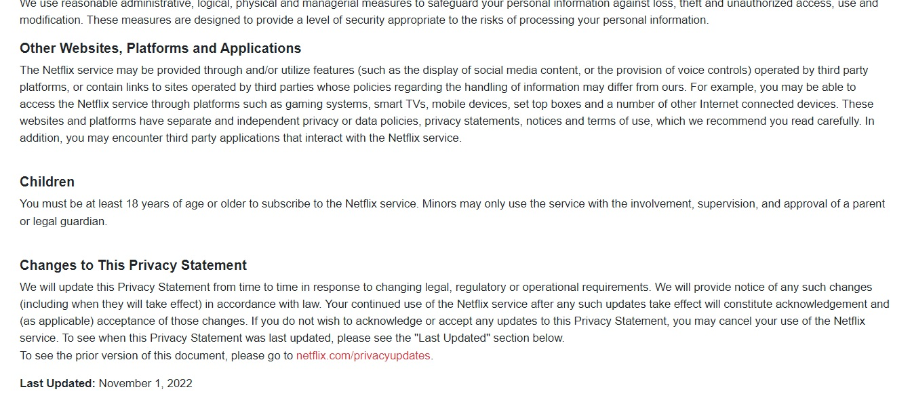
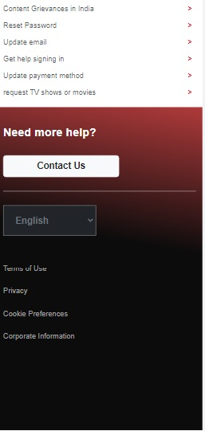

# Responsive Netflix Website Frontend Clone 

## Description :
I have created a responsive **Netflix** website frontend clone consisting of 23 unique pages using React.js and Bootstrap. The project features a sophisticated navbar and complex page structures to enhance user navigation and engagement. It showcases a seamless and visually appealing user experience, adapting gracefully to various screen sizes and devices. The combination of React.js and Bootstrap allowed for efficient development and a modern, sleek design. This project highlights my proficiency in front-end development, responsive design.

## Key features of the Website include:

- Responsive Website - This website can be accessed on mobile,tablet,pc,laptop 

- Similar UI as Netflix - All pages have same UI of Netflix 

- Movies and Web-series Information - Easy Information about movies and web-series On single click. 

- Displayed various catagories of available content only on Netflix : 
    - New Releases
    - Popular on Netflix
    - Hindi Movies & Tv
    - Action movies
    - Documentories
    - Comedy Movies
    - Crime Tv shows 

- User Email ID validation on email input

Following ReactJS contents are used :

 -   ####  Reusable Components
 -   ####  Components
 -   ####  CSS Modules
 -   ####  React Hooks
 -   ####  onClick Events
 -   ####  onMouseOver Event
 -   ####  useState Hook
 -   ####  UseEffect Hook
 -   ####  useNavigate Hook
 -   ####  callbacks
 -   ####  Props
 -   ####  States
 -   ####  React-Router
 -   ####  JSX
 -   ####  Objects
 -   ####  Array of Objects

 Following Bootstrap contents are used :

 -   ####  Modal
 -   ####  Nav-Tabs
 -   ####  display classes
 -   ####  Img classes
 -   ####  margin classes
 -   ####  padding classes
 -   ####  border classes
 -   ####  text classes
 -   ####  shadow class
 -   ####  position classes
 -   ####  container classes
 
Font Awesome Icons are used 

### Packages installed :

- npx create-react-app 

- npm i react-router

- Github Pages

## 23 Pages
1.  HomePage
2.  FAQ
3.  Help Center
4. Accout
5. Media Center
6. Only on Netflix
7. Privacy
8. Investor Relations
9. Jobs
10. Terms Of Use
11. Contact Us
12. Corporate Information
13. Way To Watch
14. Legal Notice
15. Cookie Preferences
16. JoinNowMain
17. JoinNowOne
18. JoinNowTwo
19. JoinNowThree
20. JoinNowFour
21. JoinNowFiveOne
22. JoinNowFiveTwo
23. ForgotPassword

### Requirements - 

- Web Browser
- Internet connection

## Web Page Screenshots

- HomePage 

### In HomePage i have used regular Expression which will confirm the email Input by the user If the Email have a valid syntax then user able to navigate on next Get Started page ###

### inputed Email will send to the parent component with the Help of callbacks after that parent component will send Email to the JoinNowOne Component. ###

- JoinNowMain

- JoinNowOne

- JoinNowTwo

- JoinNowThree

### In JoinNowThree page use can select one of the given subscription packages after selecting the package information will send to the parent component with the help of callbacks and it will passed to the payment page (JoinNowFiveOne component).

- JoinNowFour

- JoinNowFiveOne

- JoinNowFiveTwo

- Account

### In Account page i have used regular Expression which will confirm the email Input by the user If the Email have a valid syntax then user able to navigate on Sign In page ###

### inputed Email will send to the parent component with the Help of callbacks after that parent component will send Email to the JoinNowOne Component. ###

- OnlyOnNetflix

### OnlyOnNetflix have displayed the various movies and web-series information to get the information of movie or series user can click on that movie or series named img box after onclick one box wil open with information ###

- InvestorRelations

- Jobs

- MediaCenter

### MediaCenter contains the movies and series information releasing in Octomber 2023 ##

### on onclick of series or movie img box one modal box will open with information of that series or movie ###

### user can select different catagories of movies and series the content will be displayed based on catagory ###

- WayToWatch

### WayToWatch page have on horizontal box contains different devices list each device have different content user can click to see ###

- ContactUs

- CoockiePreferences

- ForgotPassword

- HelpCenter

- TermsOfUse

- LegalNotice

- Privacy

- FAQ

- CorporateInformation

- Mobile Screen view of some pages

    - HomePage

 - HelpCenter

# Technologies Used

- ReactJS
- Bootstrap
- CSS

## FAQ

#### Question 1

Answer 1

#### Question 2

Answer 2

